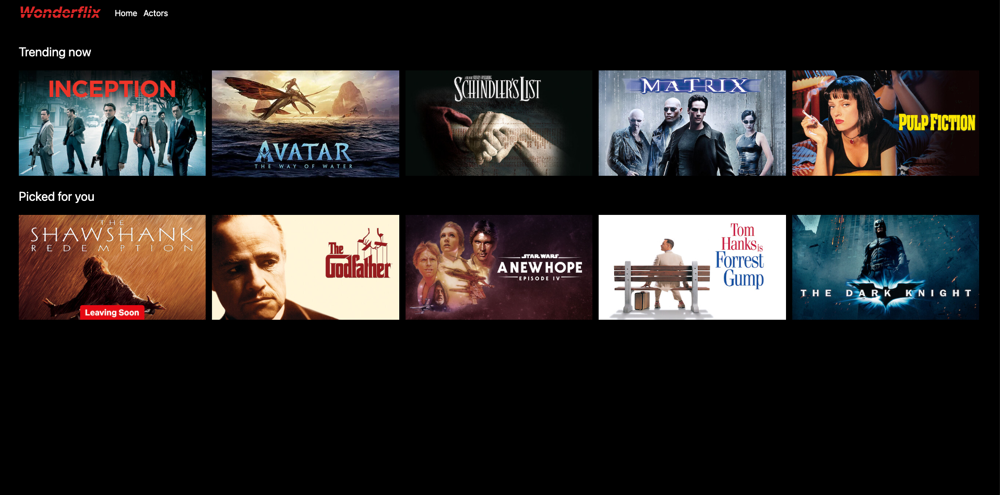

# Getting Started

This app is a React and ExpressJS setup using yarn workspaces.

## Endpoints

* Server: http://localhost:3000
* Client: http://localhost:5173

## Setup

Install dependencies and run the app using `yarn dev`

You should see the following at http://localhost:5173/home

